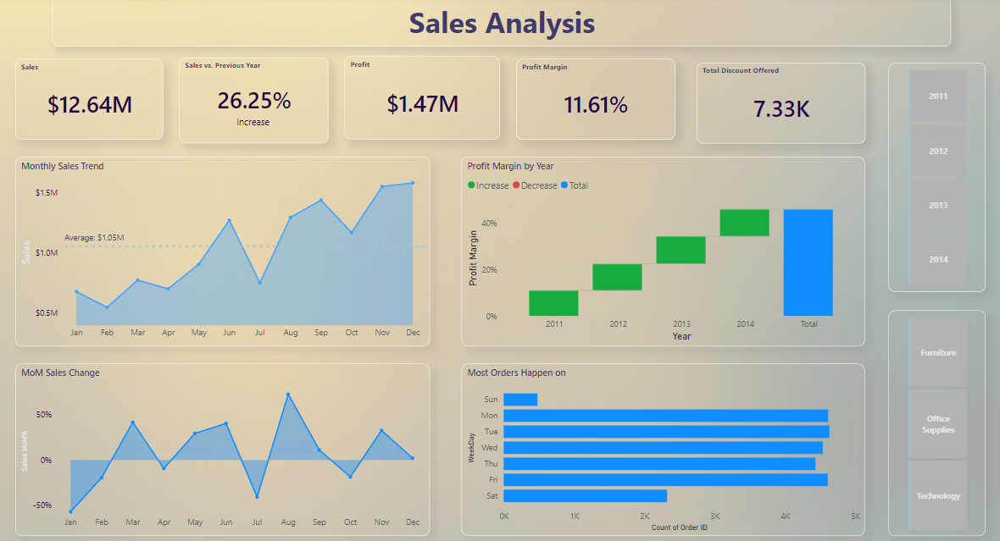
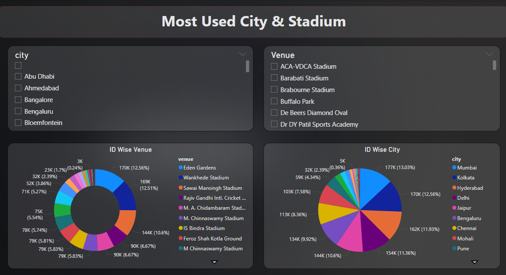
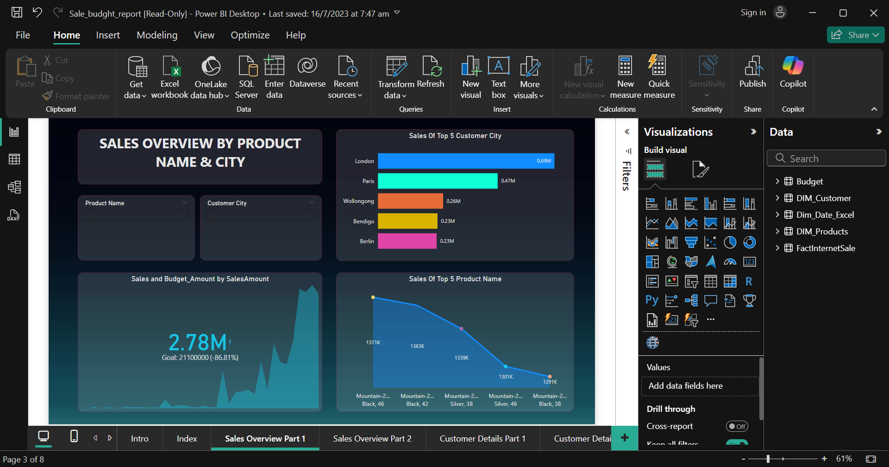
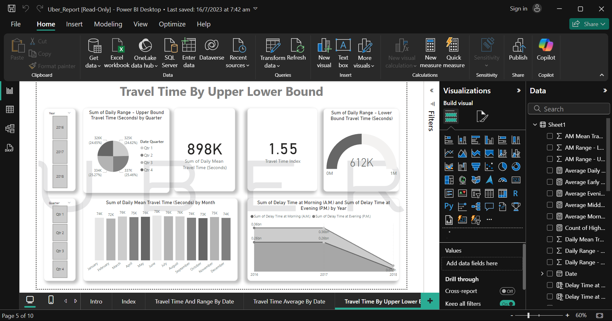
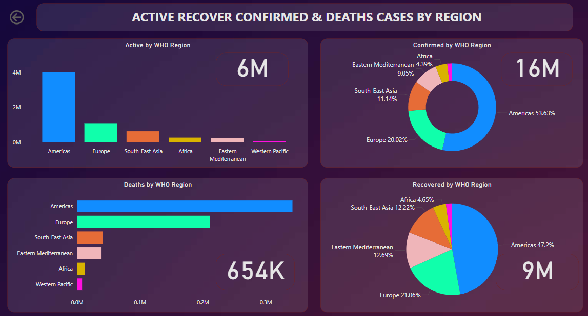
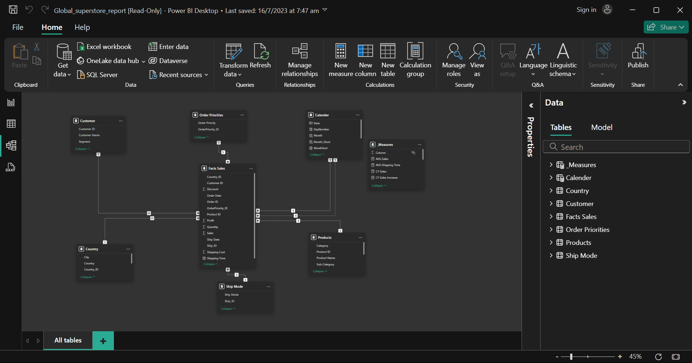

# Power BI Projects

This repository contains a collection of Power BI reports showcasing data analysis and visualization skills across various domains. Below is a brief overview of each project, including its purpose, dataset, and screenshots of the report.

---

## 📊 Global Superstore Report
**Description**: Analysis of sales performance and trends across different regions, categories, and segments.  
**Dataset**: Contains sales, profit, and shipping data.  


---

## 🏏 IPL Report
**Description**: Insights into Indian Premier League (IPL) data, including team performance, player statistics, and match outcomes.  
**Dataset**: Includes match details, player stats, and team standings.  


---

## 💼 Sales Budget Report
**Description**: Visualization of sales budgets compared to actual sales, highlighting areas of overperformance or underperformance.  
**Dataset**: Sales and budget allocation data.  


---

## 🚖 Uber Report
**Description**: Analysis of Uber ride data, covering trip duration, locations, and user preferences.  
**Dataset**: Trip and user statistics.  


---

## 🦠 COVID-19 Country-wise Analysis
**Description**: A detailed report on COVID-19 statistics, including case numbers, recovery rates, and regional impacts.  
**Dataset**: Provided in the file `country_wise_latest.xlsx`.  


---

## 🗂️ Data View Overview
**Description**: This image illustrates the Data View feature in Power BI, showcasing the structure and relationships within the datasets.  


---

## 📂 Repository Structure
- **Reports**: Contains Power BI report files (`.pbix`) for all projects.
- **Datasets**: Includes raw data files used for creating the reports.
- **Images**: Screenshots of the reports and the data view.

---

## 🚀 Getting Started
1. Clone the repository to your local machine:
   ```bash
   git clone https://github.com/yourusername/powerbi-projects.git

2. Open the .pbix files in Power BI Desktop to explore the reports.